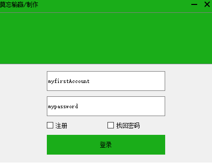
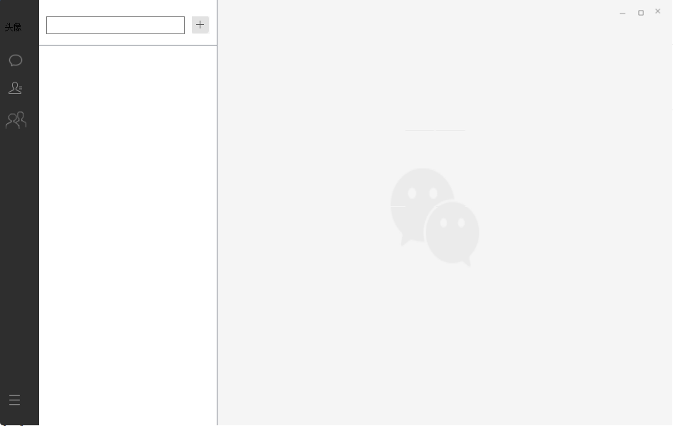
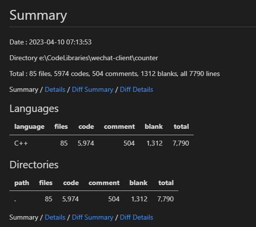

# .Vc++ Qt 版微信

注：文件使用相对路径格式一定要使用“/”,如果使用的是“\”则，在windows下路径没有问题，但是提交到gitee上图片路径就对不上了，所以还是要使用"/"作为路径的分割符号，这样才能通用

## 介绍

Vs+qt 使用c++开发仿照微信的聊天

## 软件架构

关于页面ui设计的总体思路，及各个模块设计之后再总结吧。

## 安装教程

无需安装，目前程序发行是采用解压的版本

## 开发日志

### 效果预览

### 详细内容

参见[开发日志](./docs/history.md)

### 代码统计

2023/04/10，工程有效代码量为5000多行，详细信息如下：

