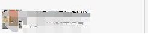

# 搜索框分析与设计

参考图片：

界面上的搜索框搜索结果分为三个部分，包括：联系人、群聊、聊天记录

## 联系人

包括联系人标签及联系人的子项，联系人标签：，联系人子项目：，包括左侧头像及右侧文字说明。点击子项目后，转到和此联系人相关的“会话”的窗口。

## 群聊

包括群聊标签及群聊子项，群聊标签：，群聊子项：，包括左侧头像及右侧文字说明。点击子项目后，转到和此群聊相关的“会话”的窗口。

## 聊天记录

包括聊天记录标签及消息子项，聊天记录标签：，聊天记录子项：，点击成功后，按照“会话”显示其中具体详细信息。

