## 开发日志

### 2022/1/5 寻找现在项目中存在的bug

#### bug1:创建群聊后，会话窗口中没有出现该群聊会话

#### bug2:创建群聊后，再次点击创建群聊按钮时候，页面上还有部分数据没有清空

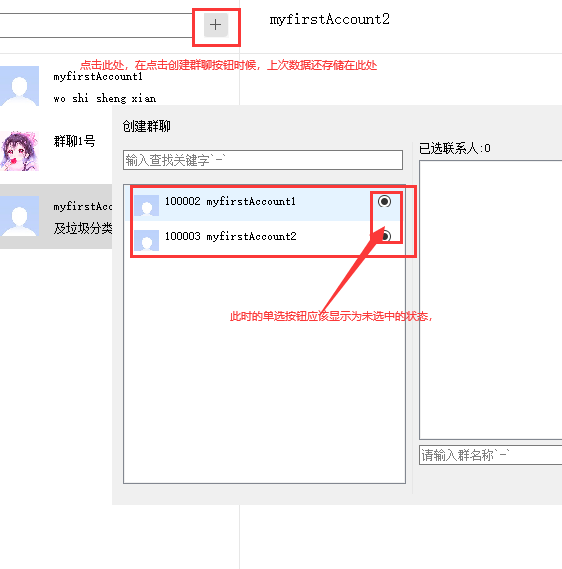

#### bug3:创建群聊的用户，在右方点击群组时候，群组列表中含有刚刚创建的群，但是其他群组成员中群组列表中并没有显示刚刚创建的群，更为奇怪的是创建群组的用户，消息列表中没有相应的会话，但是其他用户含有相应的会话

未出现群组信息

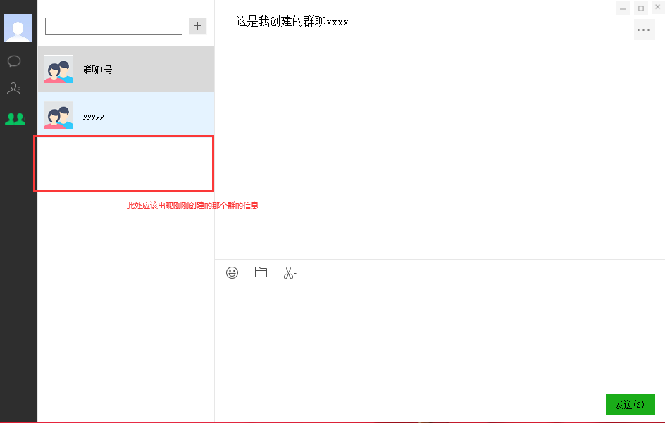

消息列表中未出现相应的会话

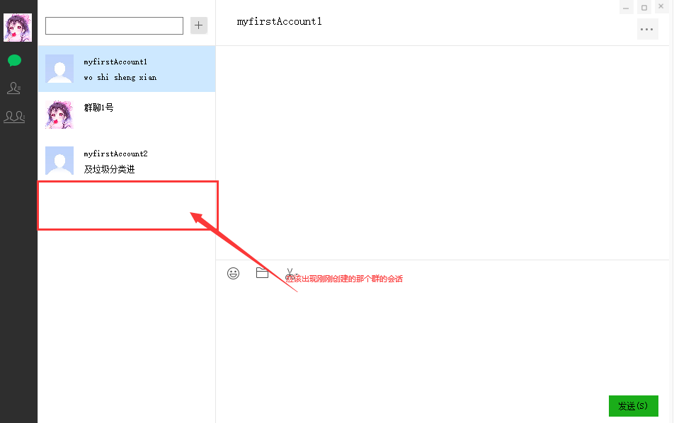

#### bug4:群组头像没有显示正常(这个暂时不着急，开发设置群头像在修改)

#### bug5:点击查找好友时候，将自己的信息也设置到其中了，还有没有显示正确玩家头像

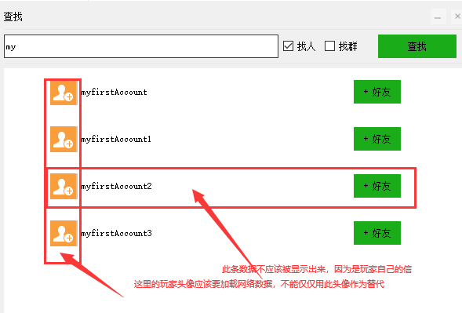

#### bug6：现在并无断线重连机制，应该增加断线重连机制

#### bug7：向某个玩家发送好友请求后，好友验证页面并自动刷新，然后最后显示的信息有点不太完整：如该显示玩家头像但是却没有显示玩家头像

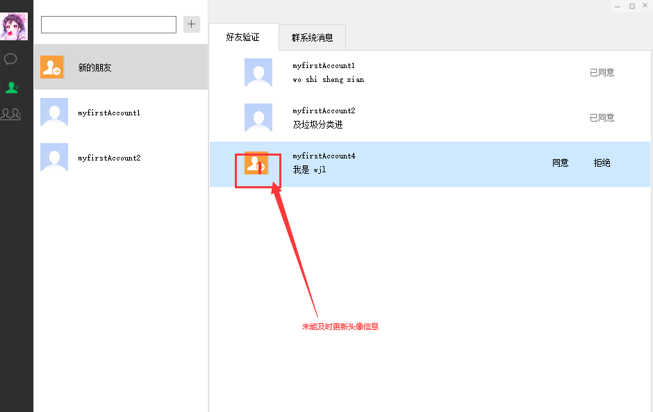

#### bug8:点击同意按钮后，消息列表和群列表并没有及时更新

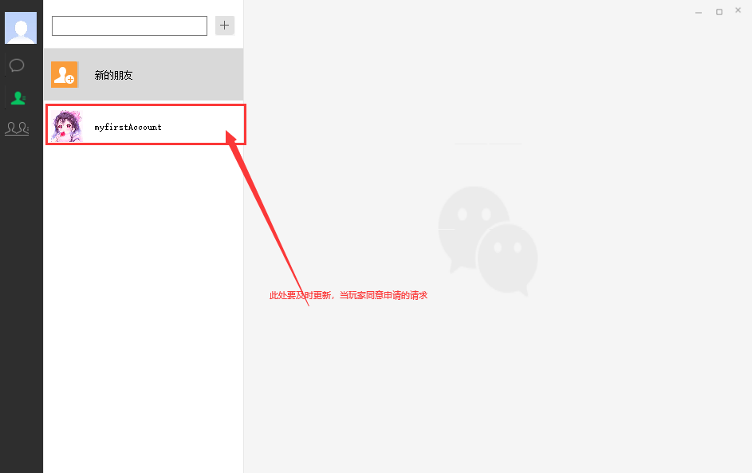

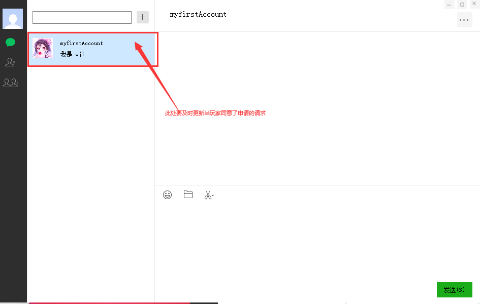

### 2022/1/19 修改项目的各种名称及文件夹

#### 1、修改项目名

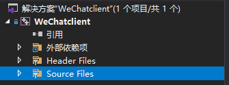

#### 2、修改文件名及目录名

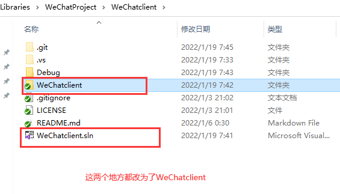

#### 3、内部相关项目文件

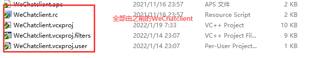

#### 4、关于现在想到的一些问题

现在请求远端图片和文件都是直接请求远端，这样会造成资源的浪费，之后会改成任务队列的请求远端文件，这样全局共用一个，来请求不过需要增加相应的队列及锁，这里是初步想法

### 2022/1/23 更换访问的端口为80端口，添加新的控件QEditLabel,QEditLabel为可以编辑的label

#### 显示Label，隐藏LineEidt

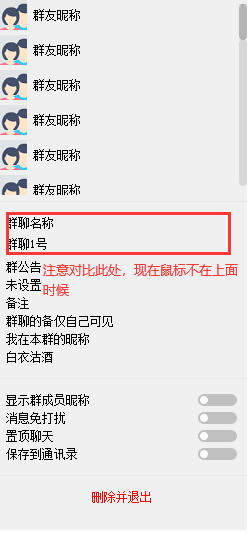

#### 显示LineEdit，隐藏QLabel

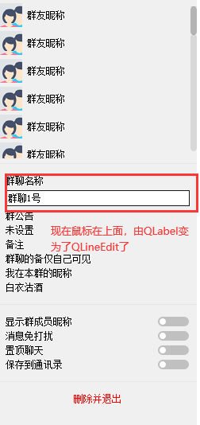

### 2022/2/6:群头像和用户头像初步设计

#### 之前头像和用户对应关系为

```
用户id ->  用户id.png

例如：userid = 100001 (用户id一般为6位数字)那么对应远端的用户头像为 100001.png
```

##### 优点

利用http请求上传头像和修改头像的时候，只要知道用户id，就能找到此用户id对应的头像

##### 缺点

考虑到群id和用户的id是会重复的。所以必须加强群的头像和玩家头像的区分，以便之后访问到正确的用户头像和群的头像

#### 改进方案

##### 用户头像的对应方式如下

```
用户id  -> u+用户id.png

例如：userid = 100001 (用户id一般为6位数字)那么对应远端的用户头像为:u100001.png
```

##### 群头像的对应方式如下

```
群id -> g+群id.png

例如：groupid = 100001 (群id一般为6位数字)那么对应远端的该群头像为:g100001.png
```

#### 具体实施步骤

##### 头像实在何处设置的？

在函数

```
void QPictureToolWnd::slot_determineBtnClicked()
```

中，是用户点击确定按钮时候，向远端服务器发送请求，在此处会设置玩家上传的头像的名：

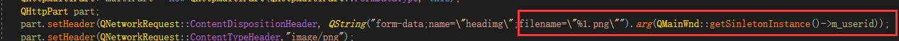

##### 更换玩家请求用户的头像名

在QCommContactItemWnd的构造函数中会向远端请求头像，具体代码如下，需要修改部分将会用红框标出

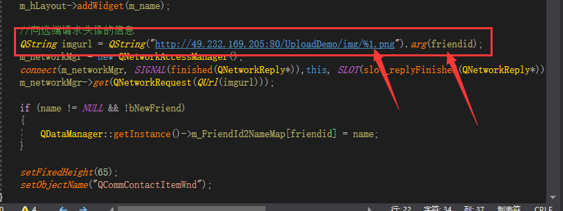

#### 现在想到的不足之处

##### 利用http请求远端的话最好做成队列式，不要创建那么多链接

##### 时间不够，未能补充关于群头像相关修改内容，明天再说

### 2022/2/7:修改了用户头像及群头像的请求方式，提出新的关于请求头像的方案，队列式请求头像，即：请求一张头像完成后，才请求另一张头像，还有历史遗留的一个问题：res文件夹应该被消灭了，明天优先修改这个

#### 关于修改的一点记录

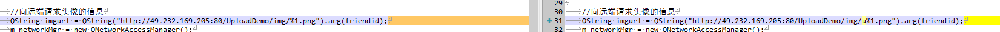

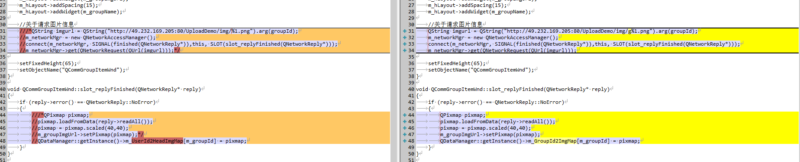

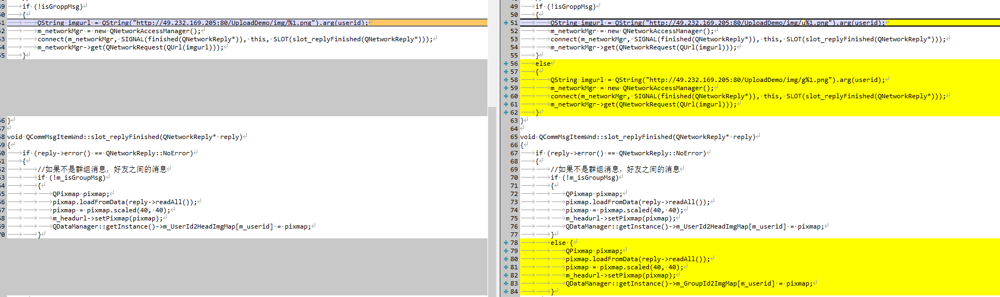

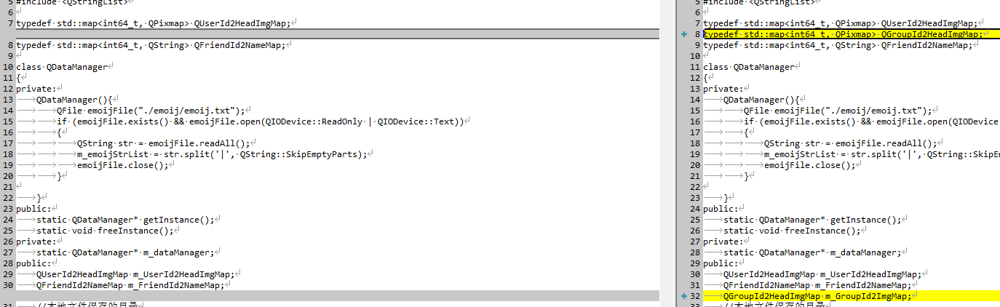


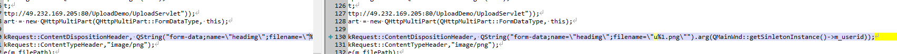

#### 关于请求头像方案的整改，在现实中的例子如

排队买包子，只有当前一个人买了或者不买，才会轮到下一个人，这样就会有序。此方案应该涉及到任务队列，线程等知识，这部分内容明天整改

#### res文件夹应该被消灭了

将res中相应文件移到img文件夹中（请明天整改）

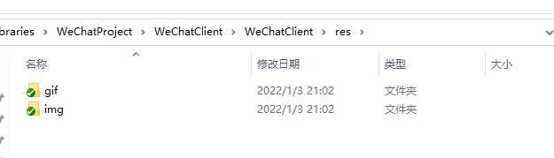

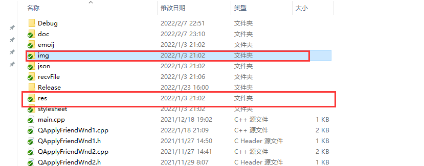

#### 今日成果展示

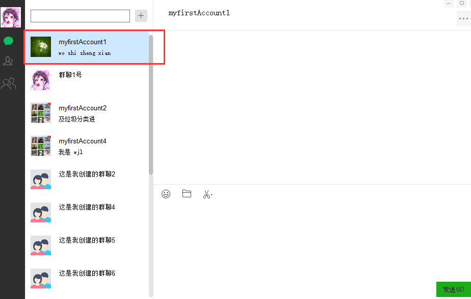

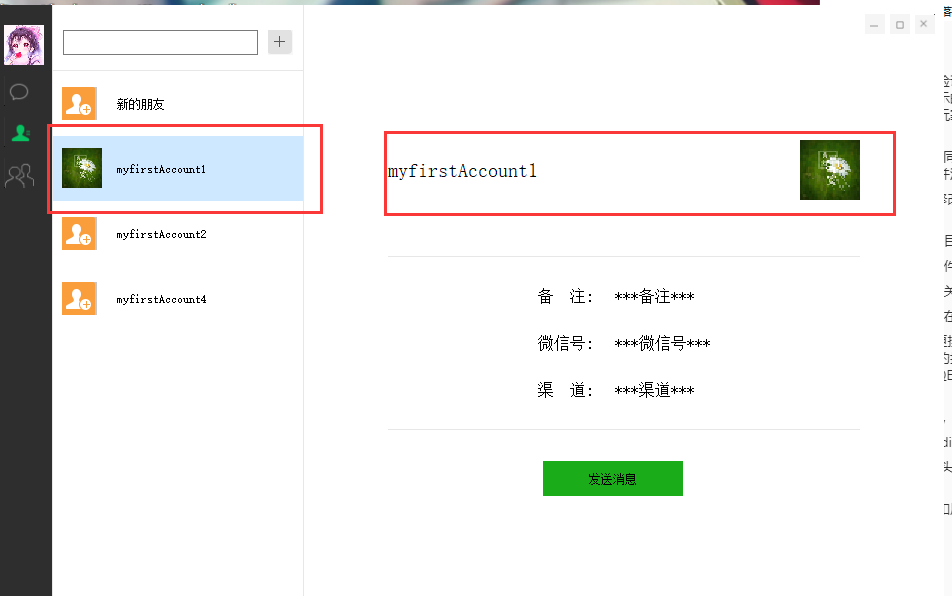

##### 注：今日群头像和好友头像修改基本完成。准备休息

### 2022/4/4 群聊获取群里所有好友信息

#### 注：如何查看当前客户端连接的远程服务器地址

在文件QWSClientMgr.cpp中如下位置：

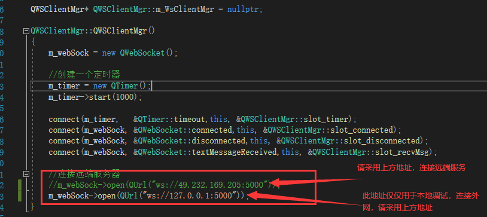

### 不是群聊会话，应该要隐藏moreBtn,相应对比图如下

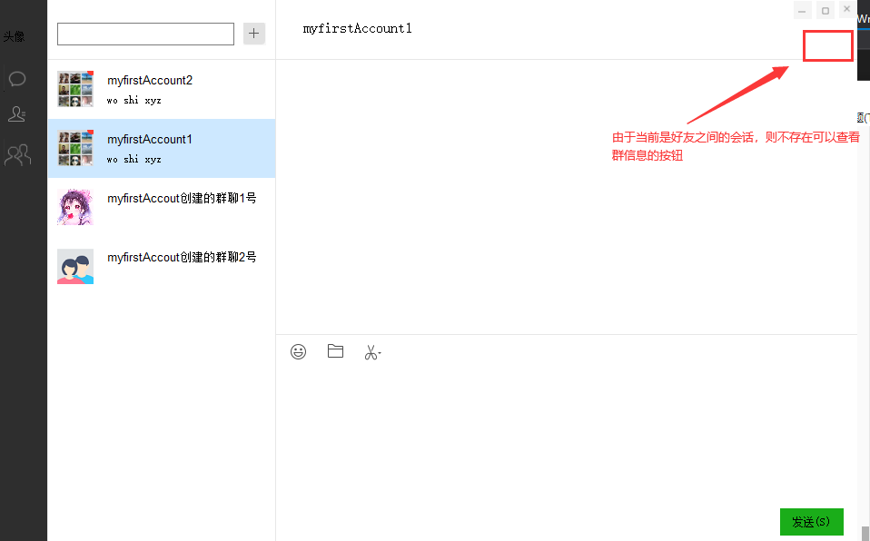

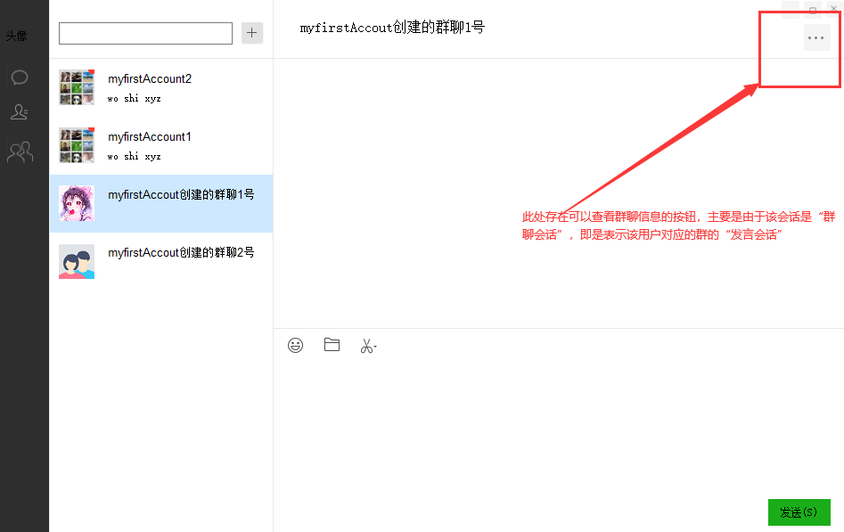

### 2022/4/6 实现向远端请求群内好友列表

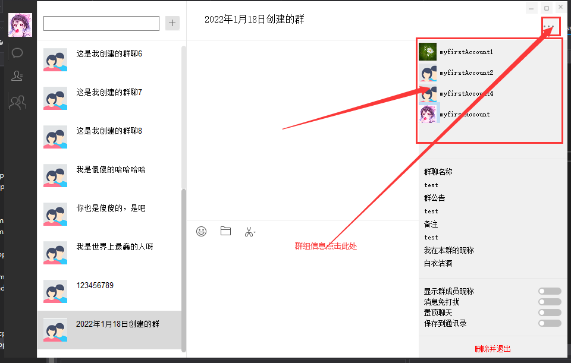

### 2022/4/14 完善显示群内好友列表

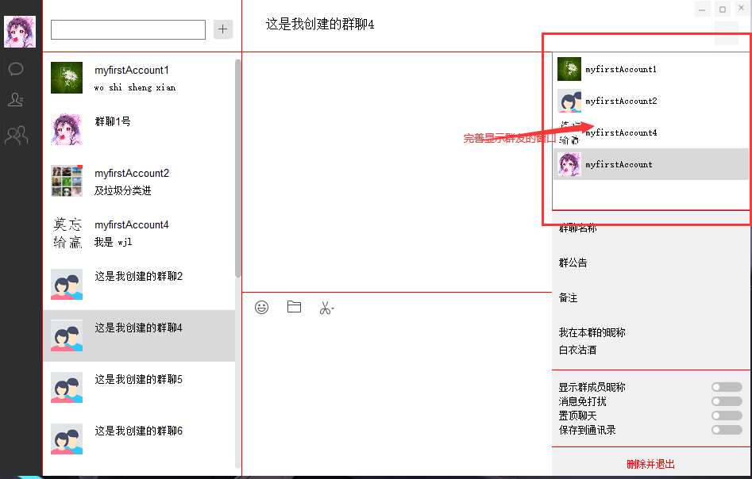

关键部分代码：

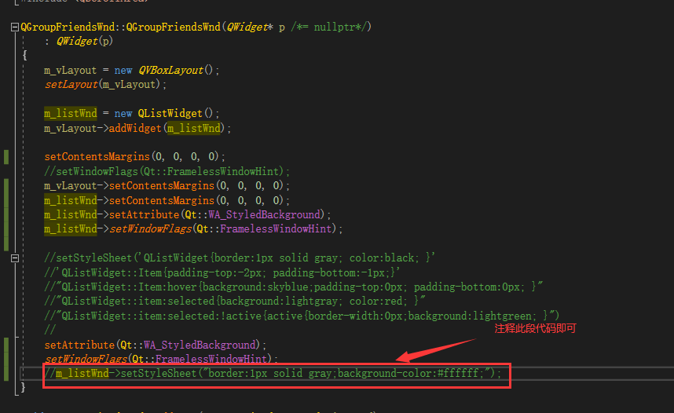

### 2022/4/16 修改群信息窗口中的字体大小

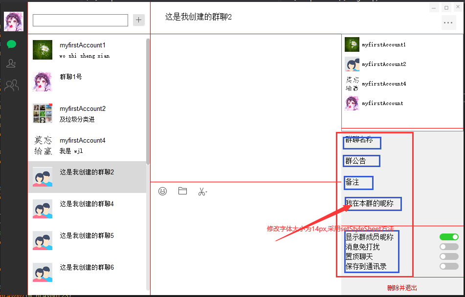

### 2022/4/17 给用户添加滚动条

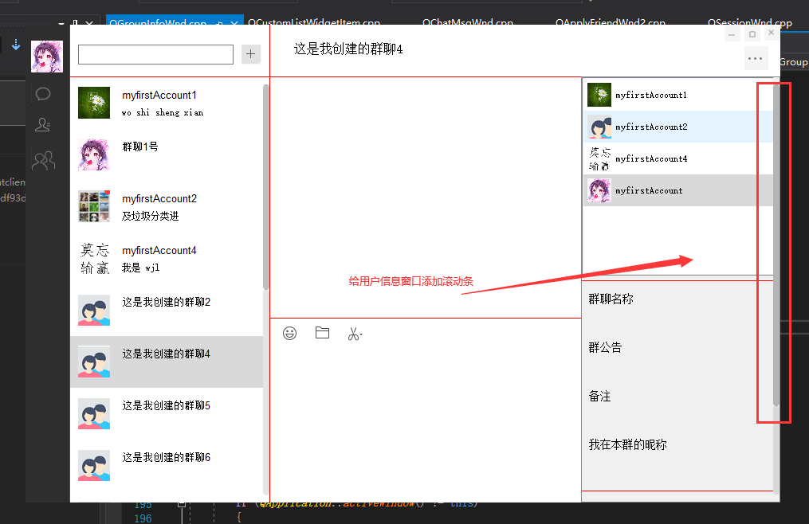

具体相关代码为：

```c++
QGroupInfoWnd::QGroupInfoWnd(QWidget* p /*= nullptr*/) : QWidget(p)
{
 //
 setFixedSize(250, 535);

 QScrollArea* m_scrollArea = new QScrollArea(this);
 QWidget* m_tempWnd = new QWidget(this);
 //m_scrollArea->setWidget(m_tempWnd);
 m_scrollArea->setGeometry(0, 0, 250, 535);
    ……
    ……
    m_scrollArea->setWidget(m_tempWnd);
}
```

### 2022/4/18 修改好友列表框线，及发布新的任务思考

#### 好友框线修改

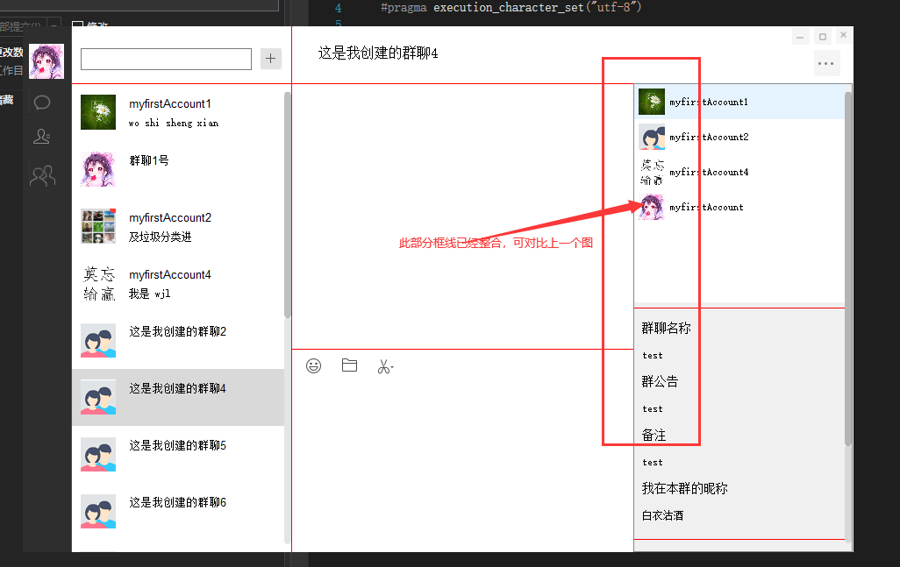

#### 后续整改方案

* 服务器将会支持群聊名称
* 服务器将会支持群聊公告
* 服务器将会支持备注
* 服务器将会支持“我在本群内昵称”
* 支持显示成员昵称
* 删除并退出功能

### 2022/4/18 支持设置修改群聊名称，支持修改群公告，支持修改我在群中的昵称

#### 支持修改群聊名称

在mx_user_group表中含有字段groupname的字段，要修改groupname只需要修改数据库中该字段值就可以

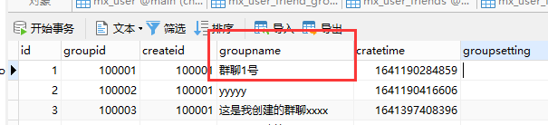

#### 支持修改群聊公告

在mx_user_group表中含有字段groupsetting字段，要修改群聊公告，将groupsetting看成群聊设置的一个json串，{“GroupChatAnnouncement”:“公告内容”}

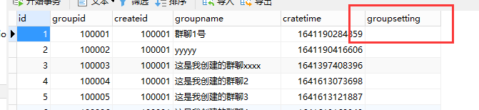

#### 支持修改我在群聊中昵称

在mx_user_friend的表中含有remarks字段，用于表示我在群聊中的名称。

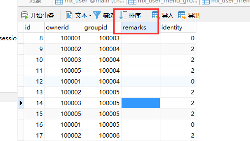

### 2022/7/30 优化群信息窗口

#### 修改过程

主要修改了QEditLable的样式及进入QEditLabel时候，将标签的文本值给label；将QEditLabel中的QLabel样式设置为无边框。

#### 效果展示

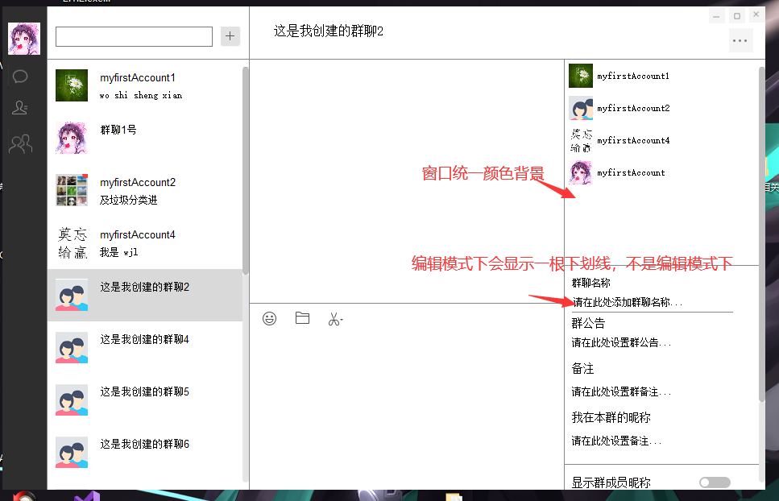

#### 后续计划

* 完善截图工具
* 发送的文本框需要支持图片复制
* 顶部的搜索框需要为其补充功能
* 完善好友查找窗口，看是否可以集成到主窗口中
* 主要为补充查找到玩家的头像信息等

### 2023/04/08 日志优化

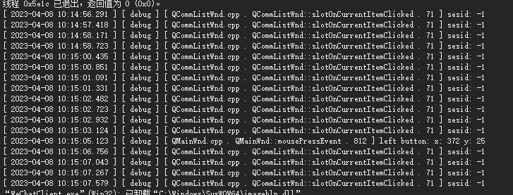

## 2023/04/24 界面优化

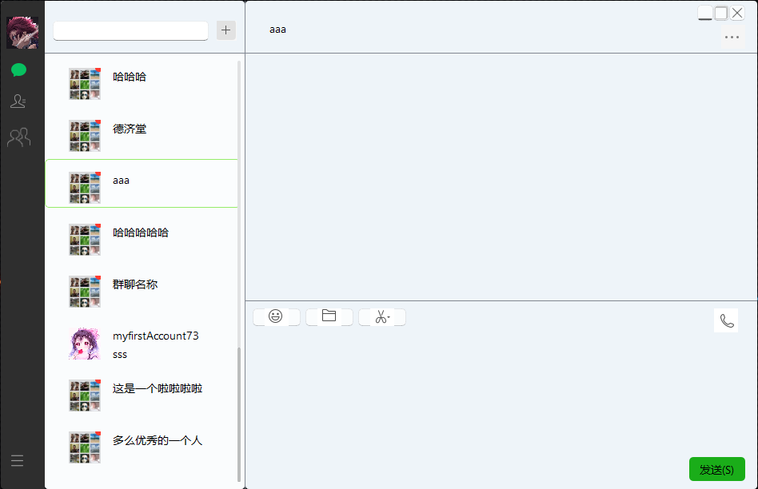